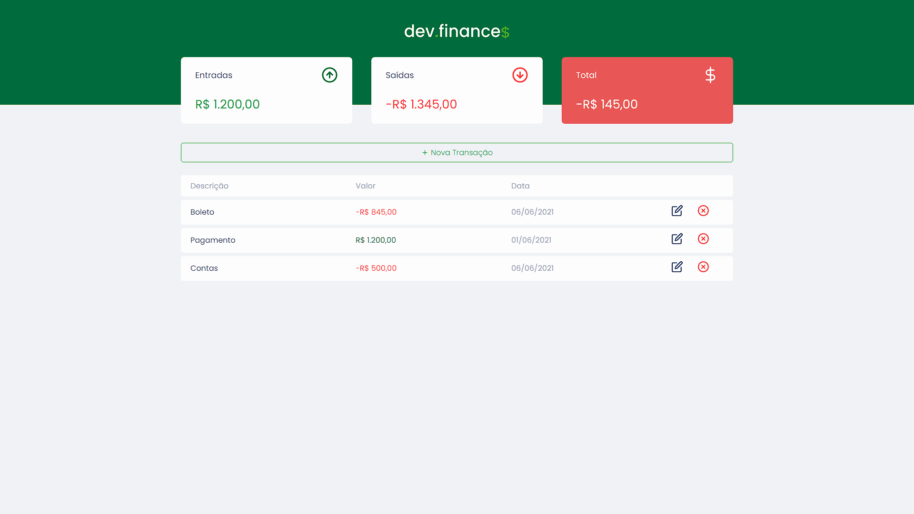

<h1>
	<strong>DevFinanceTS</strong>
</h1>

<h4 align="center"> 
	🚀 Maratona Discover
</h4>

## 💻 Projeto

DevFinanceTS é um projeto feito em TypeScript com base no projeto dev.finance$ criado por "<a href="https://github.com/Rocketseat">Rockeseat</a>".

## 📷 Preview

## ❗ Importante

use `yarn start` em /web para inicar o projeto.

## ⚙ Tecnologias usadas no projeto:

- [React](https://reactjs.org)
- TypeScript
- Styled Components
